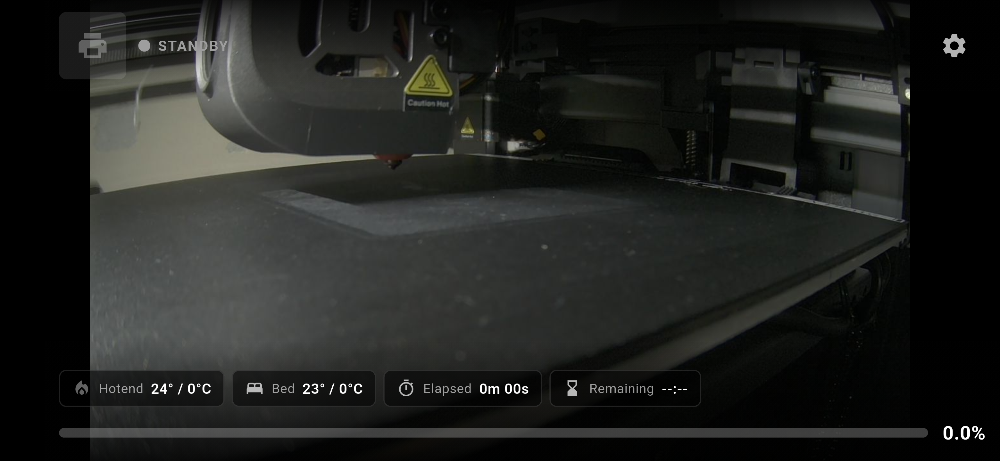
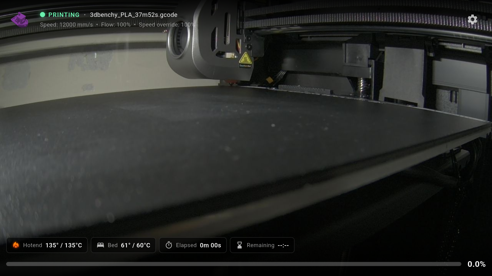
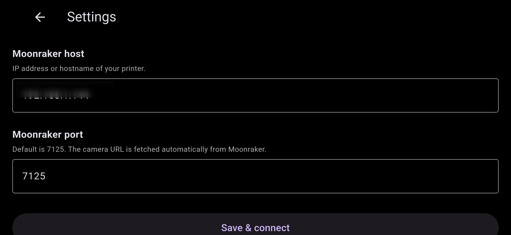
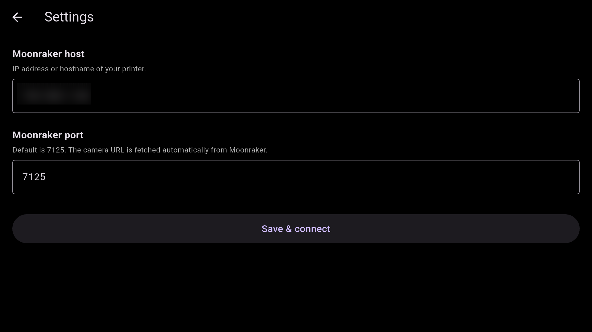

# Moonraker Viewer

A Flutter app that shows your 3D printer's MJPEG camera feed fullscreen with a live print status overlay. Connects to a [Moonraker](https://moonraker.readthedocs.io) server over WebSocket. Read-only — no pause/resume/cancel controls.

Works on Android phones and Android TV / Google TV.

---

## Screenshots

| Viewer (phone) | Viewer (TV) |
|---|---|
|  |  |

| Settings (phone) | Settings (TV) |
|---|---|
|  |  |

---

## Features

- Fullscreen MJPEG camera feed in landscape immersive mode
- Pinch-to-zoom + pan (double-tap to reset)
- Tap to toggle overlay visibility
- Live status overlay via Moonraker WebSocket:
  - Printer state, filename, ETA wall clock
  - Hotend and bed temperatures (with heating indicator)
  - Progress bar, elapsed / remaining time
  - Speed, flow rate, speed override
  - Layer count (`current / total`)
  - Print thumbnail (fetched from Moonraker)
- **Klipper console overlay** — last 15 messages with timestamps, bottom-right corner (toggleable in Settings)
- Webcam URL auto-detected via `/server/webcams/list`
- Keep screen on toggle
- Auto-reconnect on connection loss
- Android TV / D-pad remote support (select toggles overlay; arrows navigate settings)
- Settings persisted via SharedPreferences

---

## Setup

```sh
flutter pub get
flutter run
```

**iOS only — allow cleartext HTTP** (Moonraker typically runs without HTTPS on a LAN).

Android is already configured. For iOS, add to `ios/Runner/Info.plist`:

```xml
<key>NSAppTransportSecurity</key>
<dict>
    <key>NSAllowsArbitraryLoads</key>
    <true/>
</dict>
```

---

## First run

On first launch the Settings screen opens automatically:

| Setting | Description | Default |
|---|---|---|
| Moonraker host | IP address or hostname of your printer | — |
| Moonraker port | Moonraker API port | `7125` |
| Keep screen on | Prevent the display from sleeping | on |
| Show console overlay | Show last 15 Klipper messages bottom-right | off |

The camera stream URL is fetched automatically from Moonraker. Relative stream URLs are resolved against port `4408` (Creality K1/K1C nginx proxy).

---

## Controls

| Gesture / Input | Action |
|---|---|
| Tap | Toggle overlay |
| Pinch | Zoom (1×–6×) |
| Pan (when zoomed) | Pan |
| Double-tap | Reset zoom |
| Tap gear icon | Open settings |
| D-pad select / Enter | Toggle overlay |
| D-pad arrows | Navigate settings fields |

---

## Moonraker subscriptions

`print_stats`, `virtual_sdcard`, `display_status`, `extruder`, `heater_bed`, `gcode_move` — all read-only.

`notify_gcode_response` notifications are captured for the console overlay.

---

## Known quirks

- Some K1C webcam endpoints serve multipart MJPEG with non-standard boundaries; if the feed is blank, test the stream URL in a browser first.
- `flutter_mjpeg` is sensitive to network hiccups. The error builder catches failures so the app doesn't crash, and WebSocket reconnects are independent of the camera stream.
